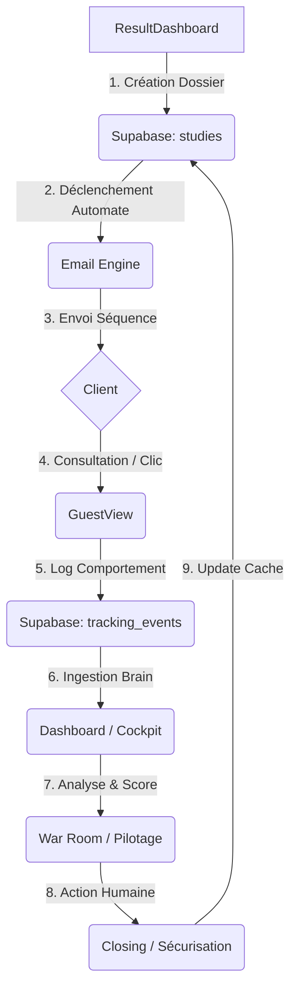

# 🛰️ AUTOPILOTE SOLAIRE — Documentation Master & Architecture (Vision 30k€)

**“Un dashboard n'est pas un miroir. C'est une prothèse de décision.”**

Bienvenue dans l'épicentre technique d'Autopilot. Ce document explique comment le système pense, comment il calcule, et comment il transforme une donnée brute Supabase en un argument commercial de haute valeur.

---

## 🧭 1. Le Cycle de Vie d'un Dossier (Data Flow)

Le système est une boucle continue d'ingestion et de réaction comportementale.

### Les Points de Contact :
1.  **FileUpload (Entrée)** : Déclencheur technique, parsing des données client.
2.  **SpeechView (Profilage Psychologique)** : Le Quiz détermine le profil (Senior/Banquier/Standard) avant toute vente. C'est le filtre cognitif.
3.  **ResultDashboard (Closing)** : L'outil de vente crée le dossier initial (`studies`) et adapte le discours au profil détecté.
4.  **GuestView (Tracking)** : Chaque seconde passée par le client sur son étude est loggée. C'est le "fuel" du Cerveau.
5.  **Supabase (Mémoire)** : Stockage centralisé, orchestration `pg_cron` et historisation `decision_logs`.
6.  **Dashboard (Projection)** : L'interface d'autorité qui consomme le cerveau.

---

## 🧠 2. Brain vs Engine : "Qui fait quoi ?"

Pour garantir la performance et la rigueur, nous avons séparé la **Donnée** de la **Raison**.

### A. Le Cerveau (The Brain — `useSystemBrain.ts`)
*   **Rôle** : L'Intendant.
*   **Mission** : Aller chercher les tables brutes (`studies`, `tracking`, `leads`, `logs`) sur Supabase.
*   **Intelligence** : Il ne calcule rien de complexe. Il "mappe" les données pour les rendre consommables (ex: transformer un ID client en un nom complet).
*   **État** : Il détient le `SystemState` global de l'application.

### B. Le Moteur (The Engine — `Engine.ts`)
*   **Rôle** : Le Stratège (Pure Logic).
*   **Mission** : Recevoir des données propres et produire des métriques.
*   **Calculs** :
    *   **Danger Score** (0-100) : Pondération temps/comportement/finance.
    *   **Behavioral Risk** : Classification (Muet, Agité, Intéressé, Stable).
    *   **Tension Level** : Santé globale du pipeline.
    *   **Recommendations** : Calcul de la "Next Best Action".

---

## 📉 3. Les Lois Business & Algorithmes

### ⚖️ La Loi du Décrochage (Drift)
Le système observe une érosion inévitable de l'intérêt post-signature :
*   **J+0 à J+7** : Zone de rassurance. Activité intense attendue.
*   **J+7 à J+14** : Zone de tension. 72% des annulations se préparent ici si le silence s'installe.
*   **J+14+** : Zone critique. Le dossier est statistiquement "mort" sans action de force.

### 💰 Calcul du ROI (CA Sauvé)
Dans l'écran **S0H (Leads & ROI)**, le chiffre herculéen (ex: 107k€) n'est pas magique :
*   **CA Sauvé** = Somme des `total_price` des dossiers qui étaient en `War Room` (Danger > 60) et qui sont passés en `Secured` (Acompte payé) grâce aux relances automatiques ou humaines.
*   **Temps Économisé** = (Nb d'emails envoyés) x (15 min de temps commercial estimé).

### ⚔️ Règles de la War Room (Risk Entry)
Un dossier entre en War Room si :
1.  `Status = signed`
2.  `Deposit_paid = false`
3.  `Danger_score >= 60` (Calculé par : Absence de clic + Silcence + Montant élevé).

---

## 🏢 4. Les Territoires Cognitifs

L'interface est découpée pour éviter la surcharge mentale de l'opérateur.

| Territoire | Rôle | Question Business |
| :--- | :--- | :--- |
| **Cockpit** | Radar | L'entreprise est-elle en danger ? |
| **War Room** | Bataille | Sur quoi dois-je tirer maintenant ? |
| **Pilotage** | Vision | Sommes-nous sur la bonne trajectoire ? |
| **Registres** | Mémoire | Qu'est-ce qui s'est passé historiquement ? |

---

## 🛠️ 5. Stack Technique de Rigueur
*   **Visualisation** : Visx d'Airbnb (Zéro décoration, 100% lecture chirurgicale).
*   **Design System** : Authority System (Grille 8px, IBM Plex Mono, Palette Institutionnelle).
*   **Orchestration** : `pg_cron` côté Supabase pour réveiller le moteur d'email toutes les N minutes.

---
*Propriété de Nicolas Di Stefano. Dernière révision doctrinale : 30 Janvier 2026.*
