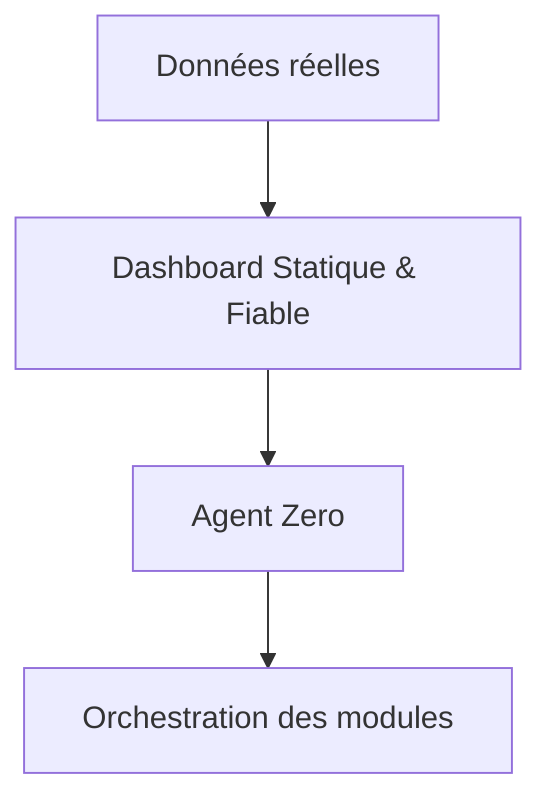

# 🦅 SYSTEM README / BIBLE (v1.0) — Agent Zero

> **Objectif du système :** Empêcher une mauvaise décision. Jamais forcer une bonne décision.
> **Agent Zero est un orchestrateur décisionnel, pas un moteur de persuasion.**

---

## 1. CE QU’EST AGENT ZERO
Agent Zero est un système de pilotage qui :
*   **observe** le contexte utilisateur
*   **identifie** un profil décisionnel
*   **ajuste** l’ordre, la visibilité et l’intensité des modules
*   **sans jamais modifier les chiffres**
*   **sans jamais inventer du contenu**

👉 **Il agit sur la structure, pas sur la vérité.**

## 2. CE QU’AGENT ZERO N’EST PAS
*   ❌ Un chatbot commercial
*   ❌ Un moteur de closing agressif
*   ❌ Un générateur de discours
*   ❌ Un IA qui “convainc”

👉 **Agent Zero n’argumente pas. Il évite l’erreur.**

---

## 3. ARCHITECTURE GLOBALE

**Séparation stricte :**
*   Le Dashboard **calcule, affiche, démontre.**
*   Agent Zero **décide quand, comment et dans quel ordre.**
*   ⚠️ Agent Zero n’accède jamais aux formules.

---

## 4. TABLEAU RÉCAPITULATIF DES MODULES (CŒUR DU SYSTÈME)

| ID | Module | Rôle | Décision directe | Piloté par Agent Zero | Verrou |
| :--- | :--- | :--- | :---: | :---: | :--- |
| **M1** | Audit & Conso | Base factuelle | ❌ | ❌ | Toujours visible |
| **M2** | Budget Mensuel | Neutraliser le prix | ❌ | ⚠️ (ordre) | Stable |
| **M3** | Garanties | Sécurisation mentale | ❌ | ✅ (profil) | Inaltérable |
| **M4** | Calendrier | Urgence neutre | ❌ | ⚠️ | Factuel |
| **M5** | Lecture du Temps | Coût de l’inaction | ❌ | ✅ | Non émotionnel |
| **M6** | Votre argent dans X ans | Projection patrimoniale | ❌ | ✅ | Calcul figé |
| **M7** | Validation Modalité | Choix cash/financement | ✅ | ❌ | Utilisateur |
| **M8** | Comparaison options | Éliminer alternatives molles | ❌ | ⚠️ | Informatif |
| **M9** | Bilan total | Constat irréversible | ❌ | ✅ | Canonique |
| **M10** | Projection 20 ans | Vérification rationnelle | ❌ | ❌ | Accordéon |
| **M11** | Lecture trajectoire | Ancrage décisionnel | ❌ | ✅ | Final |
| **M12** | Qualification terminale | Clôture logique | ✅ | ❌ | Verrou |
| **M13** | Signature / Synthèse | Acte formel | ✅ | ❌ | Légal |

👉 **Aucun module ne “vend”. Certains verrouillent la compréhension.**

---

## 5. PROFILS DÉCISIONNELS GÉRÉS
Agent Zero reconnaît (ou reçoit) un profil :
1.  **Senior**
2.  **Fatigue cognitive**
3.  **Analytique**
4.  **Banquier**
5.  **Décideur rapide**
6.  **Indécis rationnel**

👉 **Un profil n’ajoute aucune donnée, il change la lecture.**

---

## 6. RÈGLES CANONIQUES AGENT ZERO

### 🔒 Règles absolues
*   **R1** — Agent Zero ne modifie jamais les chiffres
*   **R2** — Agent Zero ne crée jamais de contenu chiffré
*   **R3** — Agent Zero ne pousse jamais après décision
*   **R4** — Toute décision peut être différée sans pénalité
*   **R5** — Aucun module critique ne peut être masqué définitivement

### 🧠 Règles contextuelles
*   **R6** — Senior + fatigue →
    *   → modules plus denses, plus institutionnels
    *   → moins de comparaisons inutiles
*   **R7** — Profil analytique →
    *   → projection longue activée
    *   → tableaux accessibles
*   **R8** — Indécision prolongée →
    *   → affichage “Lecture de trajectoire”
    *   → jamais d’urgence artificielle

---

## 7. CYCLE DE DÉCISION

**1. AVANT décision**
*   exploration
*   compréhension
*   comparaison

**2. PENDANT**
*   constats
*   trajectoires
*   choix explicite

**3. APRÈS**
*   gel
*   aucun push
*   uniquement confirmation & conformité

👉 **Le système s’arrête volontairement.**

---

## 8. AUDIT & CONFORMITÉ
Chaque session peut produire un `auditTrail` :
```json
{
  "profileDetected": "senior",
  "modulesActivated": ["M1", "M3", "M9"],
  "decisionTimestamp": "2026-02-01T12:00:00Z",
  "userAction": "signature",
  "noPostDecisionInfluence": true
}
```
*   👉 Défendable juridiquement
*   👉 Défendable moralement
*   👉 Défendable commercialement

---

## 9. INVARIANTS (À NE JAMAIS CASSER)
*   Les chiffres doivent rester vrais même si le client refuse
*   Le système doit rester valide sans signature
*   Aucun regret ne doit apparaître à J+7
*   **Agent Zero protège le client ET le conseiller**

---

## 10. ÉTAT ACTUEL DU PROJET
*   ✅ Dashboard finalisé
*   ✅ Modules complets
*   ✅ Agent Zero compatible
*   ✅ Architecture saine

⏭️ **Étape suivante (optionnelle)**
*   Formalisation Agent Zero v1 (code)
*   Packaging SaaS / Licence
*   Documentation juridique

**🎯 CONCLUSION**
*Ce document est ton socle, ta bible, ton filet de sécurité.*


---

## 11. ARCHITECTURE & SCHÉMA TECHNIQUE (VERSION FINALE)

### 🎯 Principe fondamental
> **Agent Zero est un moteur d’orchestration, pas un moteur de calcul.**
> *   Il ne touche jamais aux chiffres.
> *   Il ne génère jamais de discours chiffré.
> *   Il ne modifie que l’ordre, l’accès et la visibilité.

### 🧱 ARCHITECTURE LOGIQUE
```mermaid
graph TD
    DATA[Data Layer\n(Calculs / Prix / Projections)] -->|Lecture Seule| DASH[Dashboard Moteur\n(UI Neutre / Calculs Figés)]
    DASH --> AGENT[Agent Zero\n(Decision Orchestrator)]
    AGENT -->|JSON| API[Module Visibility API\n(Show/Hide/Order/Lock)]
```

### 🔌 INTERFACES TECHNIQUES

#### 1️⃣ Data Layer (Intouchable)
```typescript
interface CalculationResult {
  totals: number;
  projections: number[];
  savings: number;
  breakEven: number;
}
// ➡️ Jamais passé à Agent Zero
```

#### 2️⃣ Dashboard Modules
Chaque module expose seulement des hooks de visibilité. Agent Zero ne voit pas le contenu interne.

#### 3️⃣ Agent Zero Context (Input)
```typescript
interface AgentZeroContext {
  sessionId: string;
  timeSpent: number;
  modulesOpened: string[];
  modulesSkipped: string[];
  scrollDepth: number;
  hesitationSignals: boolean;
}
```

#### 4️⃣ Agent Zero Decision (Output)
```typescript
interface AgentZeroDecision {
  profileDetected: Profile;
  moduleOverrides: moduleOverride[];
  auditTrail: AuditPayload;
}
```

---
---

# 🛠 ANNEXES TECHNIQUES (Architecture & Installation)

## A. Architecture Cloud (PythonAnywhere)
*   **Endpoint :** `https://autopilote.pythonanywhere.com/decide`
*   **Sécurité :** `X-API-KEY: Titanium2025!`
*   **Stack :** Python 3.11 (Flask)

## B. Système d'Injection Dynamique (MAJ Février 2026)
Le système ne se contente plus de réordonner les modules. Il peut désormais **injecter** ou **remplacer** le contenu interne d'un module.

*   **Source :** `contentVariants.json`
*   **Mécanisme :**
    *   Le Front écoute `agentDecision.contentVariants`.
    *   Si une variante est demandée (ex: `senior_fatigue_institutional_dense`), elle remplace le contenu par défaut.
    *   Si la variante est inconnue ou absente → **Fallback automatique sur `default`**.
*   **Sécurité :** L'UI ne crashe jamais. Elle revient toujours au standard en cas de doute.

## C. Installation Locale (Mémoire)
Voir `docs/AGENT_ZERO_BIBLE.md` pour le guide d'installation complet "From Scratch".
