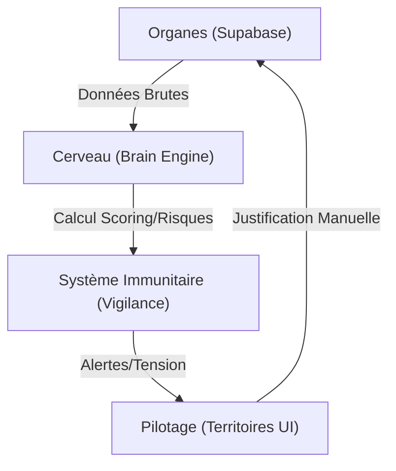

# 🏗️ Architecture Système v2 — "Territories"
**Version** : 2.0.0
**Status** : TECHNICAL GUIDE

## 🛰️ Le Nouveau Paradigme
Le système est désormais divisé en deux entités strictement isolées :
1.  **Le Brain (Cerveau)** : L'intelligence qui calcule, traite et prédit.
2.  **Le Cockpit (Interface)** : L'interface de commande qui affiche et exécute.

## 🧬 Les 4 Couches du Système

1.  **Données (Organes)** : Supabase / PostgreSQL. Capteurs bruts.
2.  **Interprétation (Cerveau)** : `systemBrain.ts`. Croisement des données, scoring de tension et de risque.
3.  **Vigilance (Système Immunitaire)** : Détection automatique des anomalies et comportements (Muet, Agité, Stable).
4.  **Pilotage (Territoires)** : La projection visuelle de la réalité.

## 🗺️ Les Territoires Étanches
L'application est découpée en territoires logiques pour éviter la surcharge cognitive :

### 1. 🛰️ COCKPIT
*   **Mission** : Briefing militaire quotidien.
*   **Contenu** : Next-Best-Action, indicateurs de vitalité, accès rapides.
*   **Règle** : Pas de listes, pas d'exploration. Uniquement de la décision.

### 2. ⚔️ WAR ROOM
*   **Mission** : Gestion des urgences absolues.
*   **Contenu** : Desk d'Exécution, Zone d'Action prioritaires (acomptes en retard).
*   **Règle** : "Si c'est ici, c'est critique."

### 3. 📊 PILOTAGE (Cockpit stratégique v2)
*   **Mission** : Diriger l'entreprise par le verdict et l'analyse.
*   **Architecture S01-04** :
    - **Authority (S01)** : Verdict financier brut (CA à risque). Aucun graphe. Ordre d'action.
    - **Understanding (S02-04)** : Moteurs Visx complexes (Attention, Momentum, Projection) pour comprendre les causes du verdict.
*   **Règle** : "Le verdict d'abord, l'explication ensuite."

### 4. 🗄️ REGISTRES
*   **Mission** : Gestion de la donnée et historique.
*   **Contenu** : Tables complètes (Axe A, B, C), filtres avancés, recherche.
*   **Règle** : Le seul endroit autorisé pour l'exploration et la recherche manuelle.

### 5. ⚙️ SYSTÈME
*   **Mission** : Diagnostic et monitoring.
*   **Contenu** : Logs du Brain, état de synchronisation.

## 🛠️ Contrat Technique
Toute information affichée dans le Cockpit ou la War Room **doit** provenir d'un calcul préalable du Brain. Aucun composant UI ne doit lire directement la base de données.
