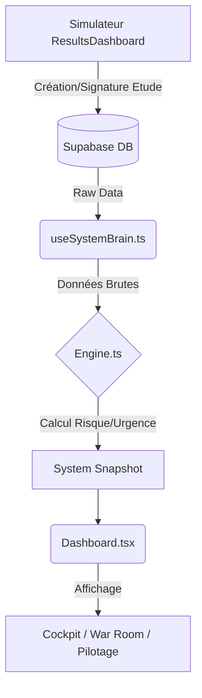

# Architecture & Flux Système : Synthèse Complète

Ce document décrit le cycle de vie complet, de la simulation client (`ResultsDashboard`) jusqu'au pilotage commercial (`Dashboard`).

---

## 1. La Genèse : `ResultsDashboard` (Le Simulateur)
Tout commence ici. C'est l'outil utilisé face au client (ou par le client en mode Guest).
*   **Fichier** : `src/components/ResultsDashboard.REFONTE2.tsx`
*   **Rôle** : Calculateur financier, moteur solaire & outil de closing.
*   **Actions** :
    *   Simule la production et la rentabilité.
    *   Valide la faisabilité technique.
    *   **Enregistre l'étude** dans Supabase (Table `studies`).
    *   Déclenche la signature (Status: `signed`).

> **C'est le Producteur de Données**. Sans lui, le CRM est vide.

---

## 2. Le Stockage : Supabase (La Vérité Terrain)
Une fois l'étude validée ou signée dans le Simulateur, elle existe en base de données.
*   Tables clés : `studies`, `email_queue`.
*   C'est le point de pivot entre la vente (Front) et le suivi (Back).

---

## 3. L'Orchestrateur CRM : `Dashboard.tsx` (Le Moniteur)
Le fichier `src/components/Dashboard.tsx` est le tableau de bord administratif.
Il ne crée pas la donnée, il la **surveille**.
1.  **Initier la Conscience** : Il appelle le hook `useSystemBrain()`.
2.  **Recevoir le Snapshot** : Il récupère les études créées par `ResultsDashboard`.
3.  **Gérer le Routing** : Il distribue ce snapshot aux "Territoires" (Cockpit, War Room, Pilotage).

---

## 4. Le Cerveau : `useSystemBrain.ts` & `Engine.ts` (L'Intelligence)
Le Cerveau digère les données brutes venant de Supabase.
*   **Analyse** : "Tiens, cette étude signée hier dans `ResultsDashboard` n'a toujours pas d'acompte."
*   **Décision** : "Je la passe en alerte rouge dans la War Room."
*   **Résilience** : Utilise `Promise.allSettled` pour charger les données (Studies, Tracking, Queue) de manière indépendante. Une panne sur le serveur d'analytics ne bloque pas l'affichage des dossiers clients.
*   **Résultat** : Production de l'`urgencyMode` et des `priorityActions`.

---

## 5. Les Territoires (L'Action)
Les vues consomment l'intelligence pour guider le manager.

### A. Le Cockpit
*   Affiche l'alerte immédiate (ex: "ACTION REQUISE" pour Boucherie).

### B. La War Room (`ExecutionDesk`)
*   Permet d'agir sur le dossier (Relancer, Sécuriser).

### C. Le Pilotage
*   Analyse les performances globales (CA généré par le Simulateur).

---

## 6. Le Cerveau Distant : Agent Zero (Le Décideur)
*   **EndPoint** : `https://autopilote.pythonanywhere.com/decide` (Cloud PythonAnywhere)
*   **Fichier** : `src/components/ResultsDashboard.REFONTE2.tsx` (Appel direct via `getAgentZeroDecision`)
*   **Rôle** : Reçoit les signaux psychologiques et décide de la stratégie d'affichage.
*   **Action** :
    *   Ne génère JAMAIS de texte (sécurité business).
    *   Orchestre l'ordre des modules (`moduleOrder`).
    *   Règle la vitesse d'animation (`presentationTempo`).
    *   Active/Désactive la rareté (`enableScarcity`).
*   **Sécurité** : Authentification via Header `X-API-KEY` (Clé : `Titanium2025!`).
*   **Intégration** : Pilotage CSS dynamique dans `ResultsDashboard`.

---



## 7. Résumé du Flux de Données

```mermaid
graph TD
    A[Simulateur ResultsDashboard] -->|JSON Profil| B[(Agent Zero Local)]
    B -->|Décision UX (Ordre/Tempo)| A
    A -->|Création/Signature Etude| C[(Supabase DB)]
    C -->|Raw Data| D(useSystemBrain.ts)
    D -->|Calcul Risque/Urgence| E[System Snapshot]
    E --> F(Dashboard.tsx)
    F -->|Affichage| G[Cockpit / War Room / Pilotage]
```

## 8. Exemple Concret : "Le Cas Boucherie"
1.  **ResultsDashboard** : Le commercial fait la simulation pour Dominique Boucherie. Le client signe sur la tablette. -> **Supabase** reçoit `status: 'signed'`.
2.  **Engine** : Lors du refresh, le moteur voit "Signé" mais "Pas d'acompte". Il calcule un risque élevé.
3.  **Dashboard** : Affiche Dominique Boucherie en haut de la **War Room** avec le statut "CLIENT PRIORITAIRE" et l'objectif "SÉCURISER (Acompte Manquant)".
